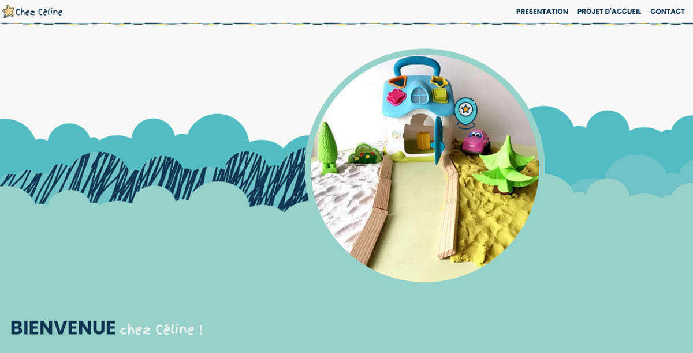

# Site Web de Céline Hubert - Assistante Maternelle Agréée



Bienvenue sur le site web de Céline Hubert, assistante maternelle agréée, créé avec l'aide des outils AI, de tutoriels youtube et d'un repo public "eleventy-blog-staticman". Ce site présente mes services de garde d'enfants, mon projet d'accueil personnalisé, et fournit des moyens de contact pour les parents intéressés.

## Sommaire

1. [Présentation du projet de création de ce site et de mes services de garde d'enfant en tant qu'assistante maternelle agréée](#présentation-de-mes-services-de-garde-assistante-maternelle-agreee)
2. [Page d'accueil](#services)
3. [Page projet d'accueil](#projet)
4. [Page foire aux question](#faq)
5. [Blog](#blog)
6. [Page de contact](#contact)
7. [Page mentions légales](#mentions-legales)
6. [Atouts](#atouts)
7. [Utilisation des images](#droits-auteur)
8. [Structure du Projet](#structure-du-projet)
9. [Contenu du Projet](#contenu-du-projet)
10. [Langages de Programmation et Framework](#langages-de-programmation-et-framework)
11. [Informations Supplémentaires](#informations-supplémentaires)
12. [Remerciements](#remerciements)


## Contenu du Site

### 1. Page d'Accueil - `index.html`
La page d'accueil introduit les services de garde d'enfants et l'accueil personnalisé que j'offre, incluant des informations sur mon parcours, ma façon de travailler, et les avantages de mon mode d'accueil.

**Contenu:**
- Présentation de mon parcours professionnel et de ma reconversion dans la petite enfance.
- Description de mon environnement de travail et des interactions avec mes propres enfants.
- Avantages de mon mode d'accueil, incluant l'attention personnalisée et les sorties quotidiennes.
- Explications sur les aides financières et les avantages fiscaux liés à l'emploi d'une assistante maternelle agréée.

### 2. Page Projet d'Accueil - `projet-accueil.html`
Cette page détaille mon projet d'accueil, incluant les activités proposées, et les valeurs éducatives que je souhaite transmettre aux enfants. Informations sur les conditions d'accueil et les modalités d'adaptation.

### 3. Page de Contact - `contact.html`
La page de contact contient un formulaire permettant aux parents de me contacter directement pour des renseignements ou pour convenir d'un rendez-vous, ainsi qu'une carte pour localiser le lieu d'accueil.

### 4. Page Mentions Légales - `mentions-legales.html`
Cette page informe les visiteurs sur les mentions légales obligatoires, incluant la propriété intellectuelle, la protection des données personnelles, les cookies, les liens externes et la responsabilité.

## Atouts
- **Accueil personnalisé:** Chaque enfant bénéficie d'une attention individuelle.
- **Sorties et activités extérieures:** Quotidiennes pour favoriser l'épanouissement.
- **Communication directe:** Lien direct avec les parents pour une meilleure coordination.
- **Sociabilisation:** Participation au Relais Petite Enfance (RPE) pour développer les compétences sociales des enfants.
- **Accompagnement administratif:** Aide dans les démarches administratives et informations sur les aides financières disponibles.


## Utilisation des Images
Les graphismes utilisés sur ce site, y compris les photos personnelles, sont soumises aux droits d'auteur de Céline Hubert. Toute utilisation ou exploitation des images sans autorisation est strictement interdite.


## Mon Projet

chubert91assmat.netlify.app était au départ un site statique en Bootstrap avec du CSS personnalisé et des animations en javascript. Pour intégrer un blog dynamique mon choix s'est porté sur le générateur de site statique Eleventy et netlify CMS qui est un CMS headless qui permet de gérer le contenu de manière décentralisée et de déployer rapidement le nouveau contenu.

## Choix des technologies

**1. Performance et rapidité:**
- **Eleventy** est un générateur de sites statiques, il génère des fichiers HTML statiques à partir des templates et contenus. Le temps de chargement est très rapide car les pages sont servies directement sans besoin de traitement serveur. L'expérience utilisateur est améliorée et le référencement SEO peut tirer parti de cet avantage.
- **Netlify CMS:** est un CMS headless qui est conçu pour fonctionner de manière optimale avec des sites statiques, ce qui améliore la performance.

**2. Flexibilité et personnalisation:**
- **Eleventy** offre une grande flexibilité en terme de configuration, de structure de projet et de design. Il supporte plusieurs langages selon les besoins du projet. Je voulais avoir un contrôle total sur chaque aspect du site, ce qui m'a permis une personnalisation poussée.
- **Netlify CMS:** permet une gestion de contenu facile et intuitive via une interface web, tout en étant déconnecté du front-end, ce qui permet une plus grande liberté dans la conception et le développement du site.

**3. Sécurité:**
- **Eleventy** est intrinsèquement plus sécurisé car les sites générés avec ce générateur ne dépendent pas de beses de données ou de scripts côté serveur qui peuvent être vulnérables aux attaques. La configuration initiale peut être plus complexe mais elle permet un gain de temps sur le long terme en ce qui concerne la maintenance et les mises à jour de sécurité et de performance contrairement à des solutions plus populaires.
- **Netlify CMS:** utilise des workflows Git pour la gestion du contenu, toutes les modifications sont versionnées et peuvent être facilement suivies et restaurées si nécessaire.


## Installation

Pour exécuter ce projet localement, suivez ces étapes :

1. Dans le répertoire du projet, exécutez la commande suivante pour mettre à jour le contenu dans le dossier _site :

npx eleventy

Vous souhaitez que le site se mette à jour automatiquement chaque fois qu'un fichier est modifié, exécutezj la commande :
npx eleventy --serve

Ouvrez http://localhost:8080 pour l’afficher dans votre navigateur.

Vous devez télecharger Node.js et npm installés sur votre machine pour exécuter le projet.


## Structure du Projet

```bash
assmatprojet/
|-- _data/ 
|    |-- metadata.json <!-- Fichier de métadonnées utilisé pour configurer ou enrichir le contenu -->
|-- _includes/
|    |-- layouts/
|       |-- base.njk <!-- Modèle de base pour le site -->
|       |-- pagination.njk
|       |-- post.njk <!-- Modèle pour une publication unique d'un article -->
|       |-- postslist.njk <!-- Modèle pour la liste des publications option non utilisée pour centraliser la gestion de la liste des articles -->
|       |-- widget/
|           |-- barre-laterale-blog.njk
|           |-- footer.njk
|           |-- head.njk <!-- Métadonnées et liens dans la balise <head> -->
|           |-- header.njk <!-- En-tête global du site -->
|           |-- nav.njk
|           |-- newsletter.njk
|           |-- pagination.njk
|           |-- partage-article-reseaux.njk
|           |-- rss-link.njk
|-- admin/ <!-- Fichiers de configuration pour l'administration et Netlify CMS -->
|    |-- config.yml
|    |-- index.html
|-- categories/
|    |-- activites-enfant.njk
|    |-- actualites-locales.njk
|    |-- collectivite-rpe.njk
|    |-- entreprises.njk
|    |-- hygiene-soins.njk
|    |-- recettes-atelier-cuisine.njk
|    |-- selection-produits.njk
|-- css/
|    |-- style.css
|-- feed/
|    |-- feed.njk <!-- Modèle pour le flux RSS Atom plus moderne que le standard -->
|-- images/
|-- netlify/
|    |-- functions <!-- Fonctions serverless pour Netlify -->
|           |-- list-posts.js <!-- Fonction pour lister les publications des fichiers md dans _posts pour interface de gestion CMS --> 
|           |-- posts.js <!-- Données des publications fournit une version exploitable html du contenu des articles avec leurs métadonnées-->
|-- posts/
|    |-- dossiers-categories/
|           |-- articles.md
|-- .eleventy.js
|-- _redirects <!-- Configuration des redirections pour Netlify -->
|-- 404.md
|-- blog.njk
|-- contact.njk
|-- faq.njk
|-- favicon.ico
|-- index.njk
|-- mentions-legales.njk
|-- netlify.toml
|-- posts.njk
|-- projet-accueil.njk
|-- README.md
|-- robots.txt.njk
|-- rss.xml.njk <!-- Flux RSS standard pour le choix de l'utilisateur pour ce format -->
|-- rss.info.njk <!-- Page Informations additionnelles pour RSS -->
|-- sitemap.xml.njk
```


### Langages de Programmation et Frameworks
- HTML5
- CSS3
- JavaScript
- Bootstrap 5

### Technologies utilisées
- Eleventy (ou 11ty)
- Netlify CMS
- Nunjucks / Liquid


## Informations Supplémentaires

- **README.md:** Vous êtes ici ! Un guide rapide sur le projet.
- **robots.txt:** Fichier pour la gestion des robots d'exploration.


## Contact
Pour toute question ou demande d'informations supplémentaires, veuillez me contacter via le formulaire disponible sur la [page de contact](https://chubert91assmat.netlify.app/contact.html).

Merci de votre visite !

---

© 2024 Céline Hubert - Assistante Maternelle agréée.
